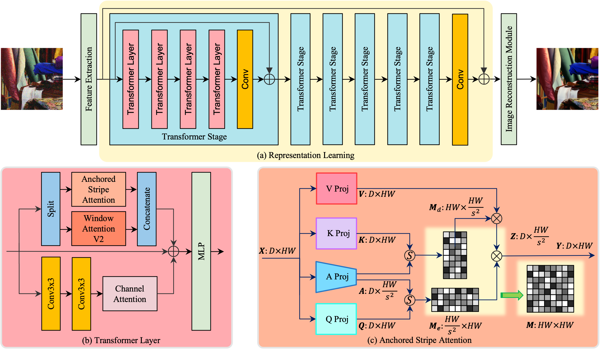
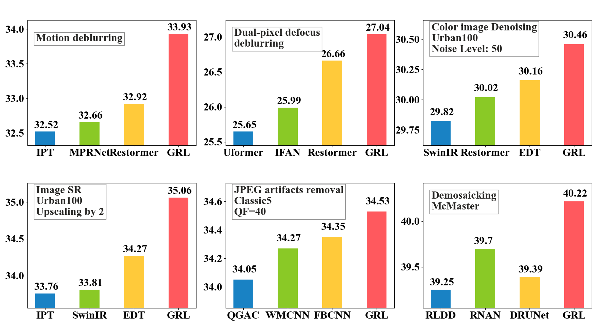
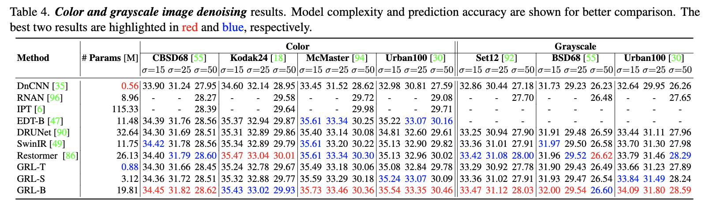
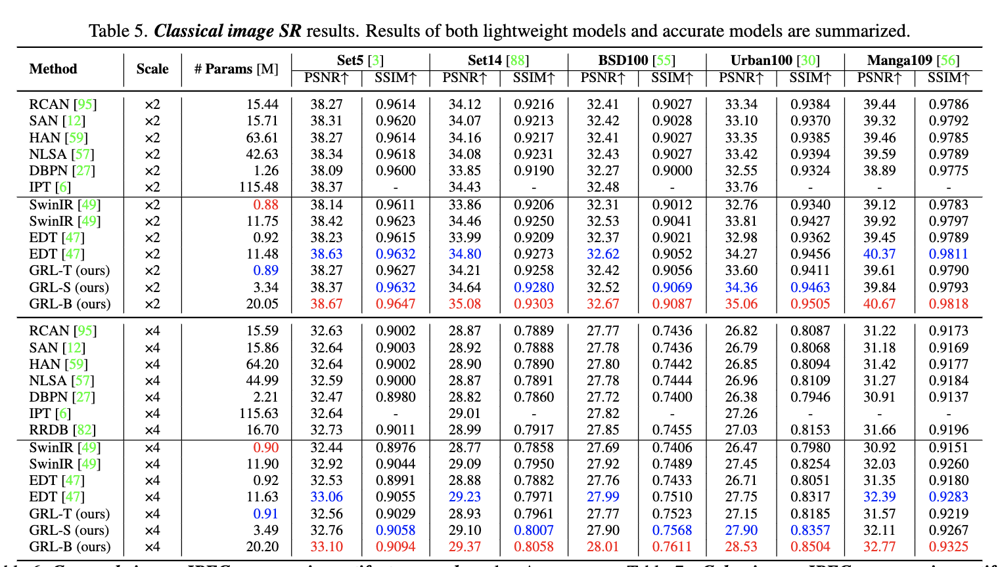
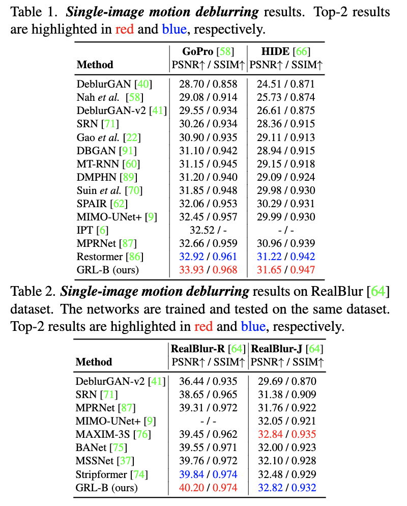
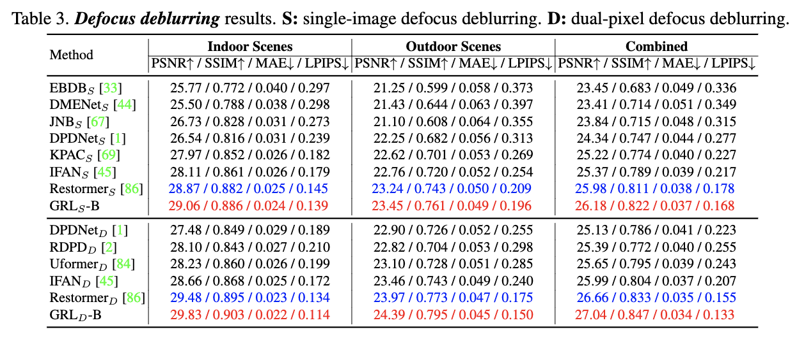
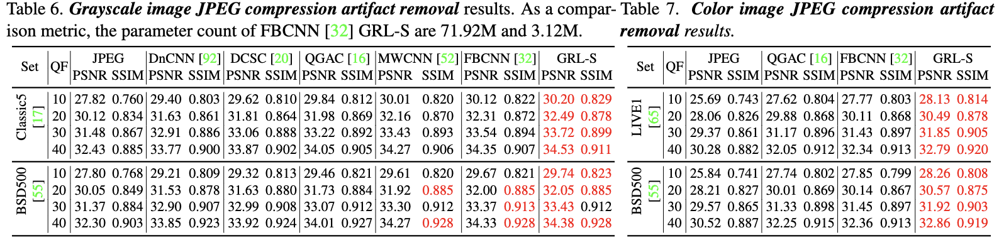
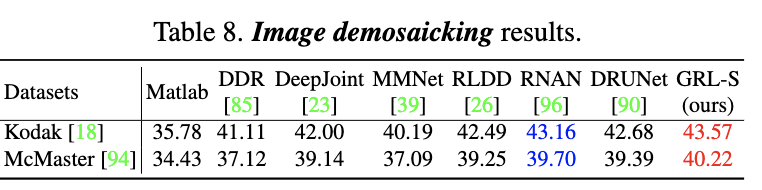
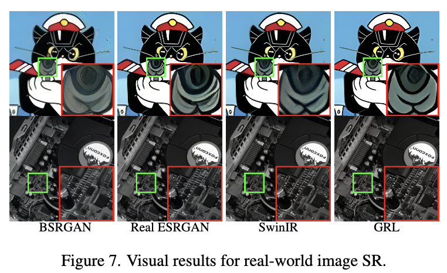

# GRL for Image Restoration

This repository is an official implementation of the paper Efficient and Explicit Modelling of Image Hierarchies for Image Restoration.

By Yawei Li, Yuchen Fan, Xiaoyu Xiang, Denis Demandolx, Rakesh Ranjan, Radu Timofte, and Luc Van Gool


## Coming soon
- [ ] GRL-B/S/T model for image denosing.
- [ ] GRL-B/S/T model for single-image super-resolution.
- [ ] GRL-B model for single-image motion deblurring.
- [ ] GRL-B model for image defocus deblurring.
- [ ] GRL-B model for real-world image super-resolution.
- [ ] GRL-B model for image demosaicking.
- [ ] GRL-S model for JPEG compression artifacts removal.

## Introduction

**GRL** provides a mechanism to
efficiently and explicitly model image hierarchies in the
global, regional, and local range for image restoration. To
achieve that, we start by analyzing two important properties of natural images including cross-scale similarity
and anisotropic image features. Inspired by that, we propose the anchored stripe self-attention which achieves a
good balance between the space and time complexity of
self-attention and the modelling capacity beyond the regional range. Then we propose a new network architec-
ture dubbed GRL to explicitly model image hierarchies in
the Global, Regional, and Local range via anchored stripe
self-attention, window self-attention, and channel attention
enhanced convolution. Finally, the proposed network is applied to 7 image restoration types, covering both real and
synthetic settings. The proposed method sets the new state-of-the-art for several of those.

<div align=center>

</div>

## Main Results

<div align=center>

</div>


## Results
<details>
<summary><strong>Image denoising</strong> (click to expand) </summary>

 
</details>

<details>
<summary><strong>Image SR</strong> (click to expand) </summary>

 
</details>

<details>
<summary><strong>Single-Image Motion Deblur</strong> (click to expand) </summary>

 
</details>

<details>
<summary><strong>Defocus Deblur</strong> (click to expand) </summary>

 
</details>

<details>
<summary><strong>JPEG Compression Artifact Removal</strong> (click to expand) </summary>

 
</details>

<details>
<summary><strong>Image Demosaicking</strong> (click to expand) </summary>

 
</details>

<details>
<summary><strong>Real-World Image SR</strong> (click to expand) </summary>

 
</details>

## Citation

If this work is helpful for your research, please consider citing the following BibTeX entry.

```
@inproceedings{li2023grl,
  title={Efficient and Explicit Modelling of Image Hierarchies for Image Restoration},
  author={Yawei Li, Yuchen Fan, Xiaoyu Xiang, Denis Demandolx, Rakesh Ranjan, Radu Timofte, and Luc Van Gool},
  booktitle={Proceedings of the IEEE Conference on Computer Vision and Pattern Recognition},
  year={2023}
}
```
